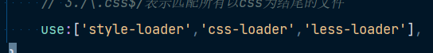

这是一个使用Webpack+express+vueRouter搭建的一个帮助大家学习history与hash路由模式的一个案例
### 踩过的坑
1. less的版本过高导致的报错  
2. 引入的的loader的顺序错误,正确如下

3. /正则表达式内容/
4. 想要启动history模式
``` shell
    git checkout main
    yarn build
    yarn dev
```
5. 想要启动hash模式
``` shell
    git checkout hash
    yarn build
    yarn start
```

